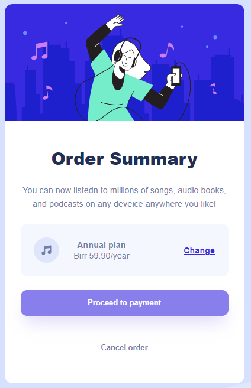

# Frontend Mentor - Order summary card solution

This is a solution to the [Order summary card challenge on Frontend Mentor](https://www.frontendmentor.io/challenges/order-summary-component-QlPmajDUj). Frontend Mentor challenges help you improve your coding skills by building realistic projects. 

## Table of contents

- [Overview](#overview)
  - [The challenge](#the-challenge)
  - [Screenshot](#screenshot)
  - [Links](#links)
- [My process](#my-process)
  - [Built with](#built-with)
  - [What I learned](#what-i-learned)
  - [Continued development](#continued-development)
  - [Useful resources](#useful-resources)
- [Author](#author)
- [Acknowledgments](#acknowledgments)

**Note: Delete this note and update the table of contents based on what sections you keep.**

## Overview
This is a simple order summary web app created using HTML and CSS. The CSS featured box-sizing and variables. 
The app has card, card title and container components with link images and buttons as contents.
### The challenge

Users should be able to:

- See hover states for interactive elements

### Screenshot

### Links

- Solution URL: [Add solution URL here](https://your-solution-url.com)
- Live Site URL: [Add live site URL here](https://your-live-site-url.com)

## My process

### Built with

- Semantic HTML5 markup
- CSS custom properties

### What I learned
On this project I have learnt about:
 - CSS variables
 - CSS selectors
 - box-sizing css property
 - Box Model
 - css over-flow property

### Continued development

I want to learn about certain css properties and HTML layout. My future focus would be:
- Layout (Flex, Box Model, div)
- Transition and Transform properties.
- Positions (z-index, absolute, relative,...)

### Useful resources
- [https://www.freecodecamp.org/learn/2022/responsive-web-design/] - helped me to learn HTML (Hypertext Markup Language) for content, and CSS (Cascading Style Sheets) for design.
- [https://youtu.be/SR5GxoFhIAU] - helped to implement this project

## Author

- Github - [Mebratu Teshale](https://github.com/mebratuteshale/)
- Frontend Mentor - [@mebratuteshale](https://www.frontendmentor.io/profile/mebratuteshale)

## Acknowledgments
My gratitude to Madison Kanna who created a wonderful video about the project helped me to join frontendmentor.
